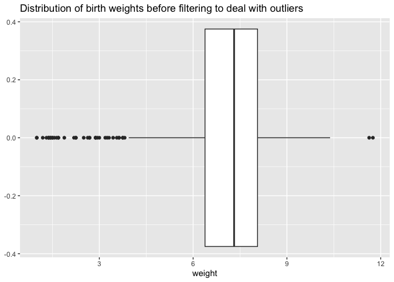
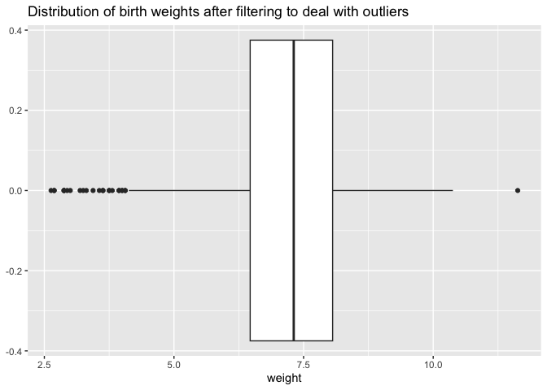
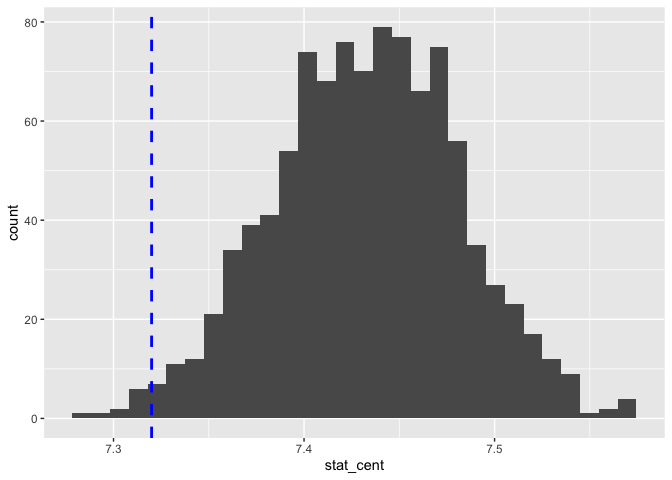
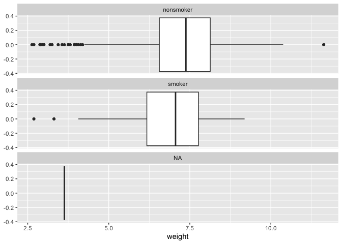
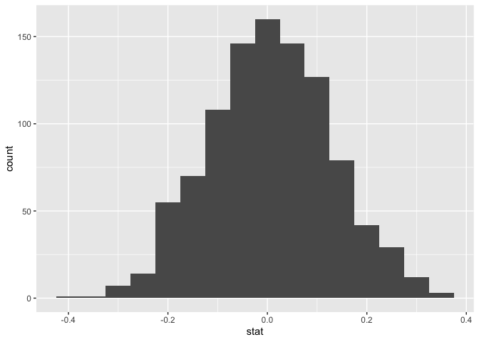

Lab 12 - Smoking during pregnancy
================
Sophie Boyd
4-20-26

### Load packages and data

``` r
library(tidyverse) 
library(tidymodels)
library(openintro)
```

### Exercise 1

The numeric variables are fage, mage, weeks, visits, gained, and weight.

``` r
ncbirths %>%
  select(fage, mage, weeks, visits, gained, weight) %>%
  summarize(across(everything(), list(mean = mean, sd = sd), na.rm = TRUE))
```

    ## # A tibble: 1 × 12
    ##   fage_mean fage_sd mage_mean mage_sd weeks_mean weeks_sd visits_mean visits_sd
    ##       <dbl>   <dbl>     <dbl>   <dbl>      <dbl>    <dbl>       <dbl>     <dbl>
    ## 1      30.3    6.76        27    6.21       38.3     2.93        12.1      3.95
    ## # ℹ 4 more variables: gained_mean <dbl>, gained_sd <dbl>, weight_mean <dbl>,
    ## #   weight_sd <dbl>

``` r
ncbirths_long <- ncbirths %>%
  pivot_longer(
    cols = c("fage", "mage", "weeks", "visits", "gained", "weight"),
    names_to = "numeric_label",
    values_to = "numeric_value")

ncbirths_long %>%
  ggplot(aes(x = numeric_value)) +
  geom_boxplot() +
  facet_wrap(~numeric_label, nrow = 6) + 
  labs(x = NULL) 
```

<!-- -->

Distributions are mostly balanced, but there is at least one outlier on
each variable. The collections of high outliers on weight gained during
pregnancy and low outliers on weeks and birth weight might be
problematic for future analyses.

### Exercise 2

``` r
ncbirths_white <- ncbirths%>%
  filter(whitemom %in% c("white"))

mean(ncbirths_white$weight)
```

    ## [1] 7.250462

### Exercise 3

- I believe that the observations in the dataset are independent of one
  another, assuming that each birth corresponds to a different mother.
  If multiple births from a mother with multiple children were featured
  in the dataset, this would violate the assumption of independence. I
  would need more information to verify.

- ncbirths_white has 714 observations, which I believe would be a
  reasonably large sample size for bootstrapping.

- In the box plot from Exercise 1, I see a collection of low outliers,
  as well as a couple of high outliers, that might influence the results
  when analyzing birth weight. I chose to restrict my range to 3
  standard deviations above and below the mean:

``` r
ncbirths %>%
  ggplot(aes(x = weight)) +
  geom_boxplot() +
  labs(title = 'Distribution of birth weights before filtering to deal with outliers')
```

<!-- -->

``` r
ncbirths_filtered <- ncbirths %>%
  filter(weight <= 11.63) %>%
  filter(weight >= 2.57)

ncbirths_filtered %>%
  ggplot(aes(x = weight)) +
  geom_boxplot() +
  labs(title = 'Distribution of birth weights after filtering to deal with outliers')
```

<!-- -->

Now I need to update my dataframe before running the bootstrapping
simulation:

``` r
ncbirths_white <- ncbirths_filtered%>%
  filter(whitemom %in% c("white"))

mean(ncbirths_white$weight)
```

    ## [1] 7.321764

The mean is slightly higher after removing the outliers. The sample size
decreased from 714 to 703, so not a substantial change.

### Exercise 4a

``` r
set.seed(123)

boot_df <- ncbirths_white %>%
  specify(response = weight) %>%
  generate(reps = 1000, type = "bootstrap") %>%
  calculate(stat = "mean")
```

### Exercise 4b

``` r
mean(boot_df$stat)
```

    ## [1] 7.322748

``` r
boot_df <- boot_df %>%
  mutate(stat_cent1 = stat - 7.32) %>%
  mutate(stat_cent = stat_cent1 + 7.43)
```

### Exercise 4c

``` r
boot_df %>%
  ggplot(aes(x = stat_cent)) +
  geom_histogram() +
  geom_vline(aes(xintercept = 7.32),
             color = "blue",
             linetype = "dashed",
             linewidth = 1)
```

<!-- -->

### Exercise 4d

``` r
boot_df %>%
  summarize(lower = quantile(stat_cent, 0.025),
            upper = quantile(stat_cent, 0.975))
```

    ## # A tibble: 1 × 2
    ##   lower upper
    ##   <dbl> <dbl>
    ## 1  7.33  7.53

``` r
boot_df %>%
  filter(stat_cent <= 7.32) %>%
  summarize(p_value = n() / nrow(boot_df))
```

    ## # A tibble: 1 × 1
    ##   p_value
    ##     <dbl>
    ## 1   0.012

1.2% of the values are as extreme or more extreme than the observed mean
of 7.32.

### Exercise 4e

The mean birth weight was significantly lower than 7.43 pounds,
informing the conclusion that average birth weight for white babies has
decreased significantly since 1995.

### Exercise 5

``` r
ncbirths_filtered %>%
  ggplot(aes(x = weight)) +
  geom_boxplot() +
  facet_wrap(~habit, nrow = 3)
```

<!-- -->

Distributions of birth weights for babies of smoking and non-smoking
mothers were similar, but the average birth weight was higher for babies
of non-smokers than babies of smokers. Both distributions were somewhat
skewed to the left.

### Exercise 6

``` r
ncbirths_clean <- ncbirths_filtered %>%
  filter(!is.na(habit)) %>%
  filter(!is.na(weight))
```

It is important to clean the data before obtaining group summaries
because participants with missing data on “habit” will not fall under
either group of interest and participants with missing data on “weight”
do not provide information about the main dependent variable of
interest.

### Exercise 7

``` r
ncbirths_clean %>%
  group_by(habit) %>%
  summarize(mean_weight = mean(weight))
```

    ## # A tibble: 2 × 2
    ##   habit     mean_weight
    ##   <fct>           <dbl>
    ## 1 nonsmoker        7.26
    ## 2 smoker           6.91

7.26 - 6.91 = 0.35. The average difference in birth weight for
non-smoking vs. smoking mothers is 0.35 pounds.

### Exercise 8

- Null hypothesis: The difference in the average birth weights of babies
  of non-smoking vs. smoking mothers is not significantly different
  from 0. (H0: µ1 - µ2 = 0)

- Alternative hypothesis: The difference in the average birth weights of
  babies of non-smoking vs. smoking mothers is significantly different
  from 0. (H1: µ1 - µ2 =/= 0)

### Exercise 9

To test whether maternal smoking is associated with a difference in
birth weight, we could simulate a distribution of mean differences in
birth weight between babies of non-smoking and smoking mothers to see if
the simulated mean difference was significantly different from 0.

- I think permutation would be the most appropriate method for this kind
  of hypothesis testing (calculating mean difference between two
  groups).

- The observed test statistic is the sample mean difference in birth
  weight between babies of non-smoking vs. smoking mothers (0.35).

- To generate the sampling distribution under the null hypothesis, I
  will simulate a distribution that is centered at 0 to represent the
  conditions under which there is no difference in birth weight between
  babies of non-smoking and smoking mothers:

``` r
set.seed(123)

null_dist <- ncbirths_clean %>%
  specify(response = weight, explanatory = habit) %>%
  hypothesize(null = "independence") %>%
  generate(1000, type = "permute") %>%
  calculate(stat = "diff in means", 
           order = c("nonsmoker", "smoker"))
```

``` r
null_dist %>%
  ggplot(aes(x = stat)) +
  geom_histogram(binwidth = .05)
```

<!-- -->

``` r
null_dist %>%
  filter(stat >= .35) %>%
  summarize(p_value = n() / nrow(null_dist))
```

    ## # A tibble: 1 × 1
    ##   p_value
    ##     <dbl>
    ## 1   0.001

- The p-value was .001. If there were no difference in the mean birth
  weight of babies of non-smoking and smoking mothers, there would be
  only a 0.1% chance of obtaining our observed result (difference of
  .35) or a more extreme result.

### Exercise 10

``` r
set.seed(123)

boot_diff_df <- ncbirths_clean %>%
  specify(response = weight, explanatory = habit) %>%
  generate(reps = 1000, type = "bootstrap") %>%
  calculate(stat = "diff in means",
           order = c("nonsmoker", "smoker"))
```

``` r
boot_diff_df %>%
  summarize(lower = quantile(stat, 0.025),
            upper = quantile(stat, 0.975))
```

    ## # A tibble: 1 × 2
    ##   lower upper
    ##   <dbl> <dbl>
    ## 1 0.113 0.579

The 95% confidence interval for differences in mean birth weight between
non-smoking and smoking mothers is from .11 to .58.

### Exercise 11

``` r
ncbirths_clean %>%
  group_by(mature) %>%
  summarize(min = min(mage), max = max(mage))
```

    ## # A tibble: 2 × 3
    ##   mature        min   max
    ##   <fct>       <int> <int>
    ## 1 mature mom     35    50
    ## 2 younger mom    13    34

The minimum age to classify a mom as “mature” is 35 years old.

### Exercise 12

- Null hypothesis: Mother’s age and birth weight are independent. There
  is not a significant difference in the proportions of low birth weight
  babies between older and younger mothers. (H0:p1 - p2 = 0)

- Alternative hypothesis (directional): Mother’s age and birth weight
  are dependent. The proportion of low birth weight babies is higher
  among mature mothers than among younger mothers (H1:p1 - p2 \> 0)

- Conditions for inference: The sample is reasonably large and
  observations are independent. There is one high outlier on maternal
  age that I will exclude before proceeding:

``` r
ncbirths_clean <- ncbirths_clean %>%
  filter(mage < 50)
```

- Test method: permutation

``` r
set.seed(123)
null_dist <- ncbirths_clean %>%
  specify(
    response = lowbirthweight,
    explanatory = mature,
    success = "low"
  ) %>%
  hypothesize(null = "independence") %>%
  generate(1000, type = "permute") %>%
  calculate(
    stat = "diff in props",
    order = c("younger mom", "mature mom")
  )
```

``` r
ncbirths_clean %>%
  count(mature, lowbirthweight) %>%
  group_by(mature) %>%
  mutate(p_hat = n/sum(n))
```

    ## # A tibble: 4 × 4
    ## # Groups:   mature [2]
    ##   mature      lowbirthweight     n  p_hat
    ##   <fct>       <fct>          <int>  <dbl>
    ## 1 mature mom  low               13 0.102 
    ## 2 mature mom  not low          114 0.898 
    ## 3 younger mom low               77 0.0906
    ## 4 younger mom not low          773 0.909

The observed difference in proportions is .012.

``` r
null_dist %>%
  filter(stat >= .012) %>%
  summarize(p_value = n() / nrow(null_dist))
```

    ## # A tibble: 1 × 1
    ##   p_value
    ##     <dbl>
    ## 1   0.369

The p-value is .369, so there is not a significant difference in the
proportions of low birth weight babies between mature mothers and
younger mothers.

### Exercise 13

``` r
set.seed(123)

boot_diff_df <- ncbirths_clean %>%
  specify(response = lowbirthweight, explanatory = mature, success = "low") %>%
  generate(reps = 1000, type = "bootstrap") %>%
  calculate(stat = "diff in props",
           order = c("younger mom", "mature mom"))
```

``` r
boot_diff_df %>%
  summarize(lower = quantile(stat, 0.025),
            upper = quantile(stat, 0.975))
```

    ## # A tibble: 1 × 2
    ##     lower  upper
    ##     <dbl>  <dbl>
    ## 1 -0.0667 0.0407

The bounds of the 95% confidence interval span negative and positive
values, meaning that a difference in proportions of low birth weight
babies in either direction would be reasonable to expect.
