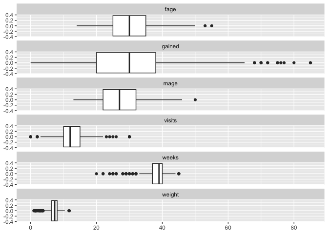

Lab 12 - Smoking during pregnancy
================
Sophie Boyd
4-10-26

### Load packages and data

``` r
library(tidyverse) 
library(tidymodels)
library(openintro)
```

### Exercise 1

The numeric variables are fage, mage, weeks, visits, gained, and weight.

``` r
ncbirths %>%
  select(fage, mage, weeks, visits, gained, weight) %>%
  summarize(across(everything(), list(mean = mean, sd = sd), na.rm = TRUE))
```

    ## # A tibble: 1 × 12
    ##   fage_mean fage_sd mage_mean mage_sd weeks_mean weeks_sd visits_mean visits_sd
    ##       <dbl>   <dbl>     <dbl>   <dbl>      <dbl>    <dbl>       <dbl>     <dbl>
    ## 1      30.3    6.76        27    6.21       38.3     2.93        12.1      3.95
    ## # ℹ 4 more variables: gained_mean <dbl>, gained_sd <dbl>, weight_mean <dbl>,
    ## #   weight_sd <dbl>

``` r
ncbirths_long <- ncbirths %>%
  pivot_longer(
    cols = c("fage", "mage", "weeks", "visits", "gained", "weight"),
    names_to = "numeric_label",
    values_to = "numeric_value")

ncbirths_long %>%
  ggplot(aes(x = numeric_value)) +
  geom_boxplot() +
  facet_wrap(~numeric_label, nrow = 6) + 
  labs(x = NULL) 
```

<!-- -->

Distributions are mostly balanced, with some high outliers on the amount
of weight gained during pregnancy and low outliers on the number of
weeks of pregnancy (which I assume are labeled as premature births with
the “premie” variable).

### Exercise 2
